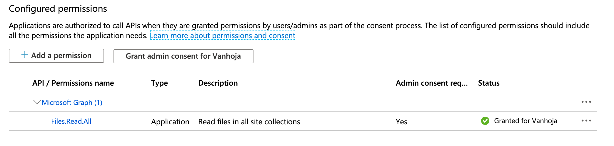
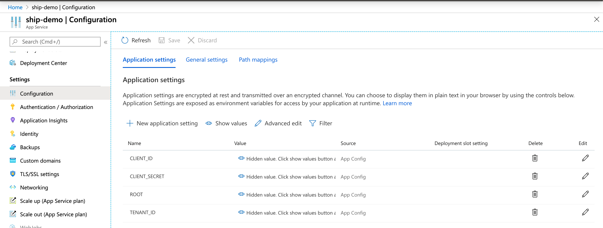

Deploying
=========

Here will once be a detailed documentation regarding deploying Ship to various
public cloud services. You should first start from
[Initial Setup](#initial-setup) and proceed to one of the platform specific
guides once you have all setup.

Environment Variables
---------------------

The following environment variables must be passed some way, regardless of the
platform of choice.

| Name            | Description                   |  Example                              |
|-----------------|-------------------------------|---------------------------------------|
| `ROOT`          | Root directory of the server. | `/sites/root/drive/root:%2Fship-demo` |
| `TENANT_ID`     | AAD tenant ID.                |                                       |
| `CLIENT_ID`     | AAD client ID.                |                                       |
| `CLIENT_SECRET` | Client secret for authentication. |                                   |

`ROOT` is a path to a OneDrive or SharePoint Online site Document Library
folder. The example uses the default Document Library of the Communication Site
and a folder called `ship-demo` under it. All the websites will be server from
here based on `Host`. Therefore for example `http://localhost:3000` would be
served from `/ship-demo/localhost`.

Per site configuration files are created in the `ROOT` folder, not under the
domain directories.


Initial Setup
-------------

### Creating a new app in Azure AD

Register a new app to Azure Active Directory by going to the App Registration
blade on the left and click *New registration*.

- Platform configuration: Background process and Automation
- Create a client secret and copy its value into a safe place
- Setup API permissions
  - `Files.Read.All`
  - Remove everything else



### OneDrive or SharePoint Online

Create a new directory in OneDrive or SharePoint Online for your new ship.

Create a new directory for serving files in
[OneDrive](https://docs.microsoft.com/en-us/graph/api/resources/onedrive?view=graph-rest-beta)
or a SharePoint Online
[site](https://docs.microsoft.com/en-us/graph/api/resources/sharepoint?view=graph-rest-beta#sharepoint-api-root-resources).
The directory can be located anywhere as long as you can figure out how
to point it in Microsoft Graph API.

By default Ship will look for directories named by domains under this
directory and serve the files from there. Anything looking like `index.*` will be
served like an index.


Generic Deployment Instructions
-------------------------------

This is a generic/platform agnostic guide to deploy a ship. You should have
completed the AAD app registration before doing this.

Install the server:

```
$ yarn install
```

Create a run script or set environment variables in whichever way you prefer.
In this repository we used Azure Apps Service for fast and easy deploy, but
there is nothing stopping you from running this on your Raspberry Pi.

Here is an example what a startup script could look like.

*run.sh*:

```bash
#!/bin/bash

ROOT='/sites/root/drive/root:/ship-demo' \
	TENANT_ID='xxxxx' \
	CLIENT_ID='xxxxx' \
	CLIENT_SECRET='verysecret' \
	yarn start
```

`TENANT_ID` and `CLIENT_ID` is given on the AAD App registration Overview tab.
`CLIENT_SECRET` was created and shown once on the Certificates & secrets tab.

Start it (probably not manually?):

```
$ ./run.sh
```

Using Azure App Services and CloudFlare
---------------------------------------

This section will guide you through setting up a ship to Azure App Services and
fronting it with CloudFlare. You should have completed the AAD app registration
before doing this.

1. Create an App Service and configure deploys with e.g. GitHub
   (You can just use the Wizard and look how the GitHub action is implemented
    in this repository)
2. Setup the environment variables (see a screenshot below)
3. Point your domain's `NS` records to CloudFlare
4. Set the following DNS records in CloudFlare:
    - `A` `@` -> `<Your App's IP as shown in Azure e.g. in Custom domains>`
    - `CNAME` -> `@`
5. Go to *Custom domains* tab in your Azure App Service
    1. Click *Add custom domain* and type in the apex domain
    2. At this point the verification may fail and Azure might ask you to add
       a `TXT` record and tell you that the `A` record is incorrect
6. Go back to Cloudflare
    1. Click the cloud symbol on the `A` record to make it point
       directly to Azure (you may revert this later)
    2. Add the `TXT` record as instructed in Azure
7. Retry adding the domain in Azure
 (and then revert back the CloudFlare proxy setting)
8. Create an origin cert in CloudFlare
    1. Goto the *SSL/TLS* tab
    2. Select *Full (strict)* encryption mode
    1. Goto the *Origin* sub-tab
    2. Click *Create Certificate*, use the defaults, and just copy & paste the
       two files
    3. As Azure needs the certificate in a different format, run the following
       in a terminal (the password can be anything and you'll only need it once):
	   `openssl pkcs12 -export -out domain.pfx -inkey domain.key -in domain.crt`
9. In Azure, go to *TLS/SSL settings* -> *Private Key Certificates*
    1. Click *Upload Certificate*, select the file, and provide the previously set
       password
    2. Go to *Custom domains* and add the *SSL Binding*
    3. At this point you may want to turn	on the *HTTPS Only* knob




Rinse and repeat. You can add as many domains as you want and the domains will
be served from the respective folders in your OneDrive or SPO Document Library.

### Redirect the www subdomain

To make `wwww` work you may either add it as a separate domain in Azure App
Services or you can make a forwarding rule in CloudFlare. The first way
allows you to serve different files for the subdomain, while the latter
just redirects to the apex domain. Here is how you can add the forwarding
in CloudFlare.

1. Go to *Page Rules*
2. Click *Add Page Rule*
3. Type this to the first input box: `www.mycooldomain.com/*`
4. Select *Forwarding URL* from the dropdown menu
5. Select `301` from the next menu
6. Type this to the last input box: `https://mycooldomain.com/$1`
7. Deploy and save
